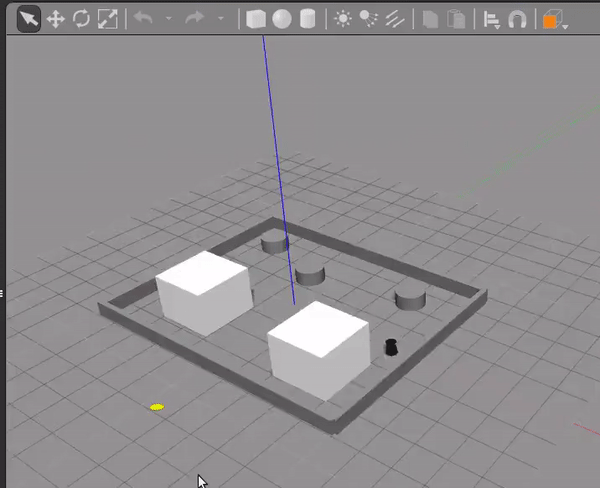

[](https://opensource.org/licenses/BSD-2-Clause)

# Simple Turtlebot ROS package #

### Overview

This program simulates Turtlebot with a walker algorithm, much like a Roomba robot vacuum cleaner. The turtlebot will move forward until reaching an obstacle within a certain range, then it will rotate until it detects that there are no obstacles and move forward again and repeat. The program will use ROS features such as subscribing and publishing to a node. In addition, we will use a launch file to launch Gazebo and turtlebot with our own map and node. The launch file has the capapibility of enabling recording of a rosbag. The file generated will then be stored in the results sub-directory. 


## License

BSD License
Copyright (c) 2019 - Pablo Sanhueza

```
Redistribution and use in source and binary forms, with or without modification, are permitted provided that the following conditions are met:

1. Redistributions of source code must retain the above copyright notice, this list of conditions and the following disclaimer.

2. Redistributions in binary form must reproduce the above copyright notice, this list of conditions and the following disclaimer in the documentation and/or other materials provided with the distribution.

THIS SOFTWARE IS PROVIDED BY THE COPYRIGHT HOLDERS AND CONTRIBUTORS "AS IS" AND ANY EXPRESS OR IMPLIED WARRANTIES, INCLUDING, BUT NOT LIMITED TO, THE IMPLIED WARRANTIES OF MERCHANTABILITY AND FITNESS FOR A PARTICULAR PURPOSE ARE DISCLAIMED. IN NO EVENT SHALL THE COPYRIGHT HOLDER OR CONTRIBUTORS BE LIABLE FOR ANY DIRECT, INDIRECT, INCIDENTAL, SPECIAL, EXEMPLARY, OR CONSEQUENTIAL DAMAGES (INCLUDING, BUT NOT LIMITED TO, PROCUREMENT OF SUBSTITUTE GOODS OR SERVICES; LOSS OF USE, DATA, OR PROFITS; OR BUSINESS INTERRUPTION) HOWEVER CAUSED AND ON ANY THEORY OF LIABILITY, WHETHER IN CONTRACT, STRICT LIABILITY, OR TORT (INCLUDING NEGLIGENCE OR OTHERWISE) ARISING IN ANY WAY OUT OF THE USE OF THIS SOFTWARE, EVEN IF ADVISED OF THE POSSIBILITY OF SUCH DAMAGE.
```

## Dependencies

This repo is intended to be used on a device with Ubuntu 16.04 LTS. Additionally, you need to have ROS Kinetic Kame installed, which comes with Gazebo (we will also use this). Finally, you will also need the Turtlebot simulation stack. The list below are things that you will need to build and use this program.

- Install ROS Kinetic. Make sure you follow all steps. Please follow link [here](http://wiki.ros.org/kinetic/Installation/Ubuntu)

- Create a catkin Package. Catkin needs to be installed. Follow link [here](http://wiki.ros.org/catkin)

- Install Turtlebot simulation stack. Follow commands shown below.

```
$ sudo apt-get install ros-kinetic-turtlebot-gazebo ros-kinetic-turtlebot-apps ros-kinetic-turtlebot-rviz-launchers
$ source /opt/ros/kinetic/setup.bash
```

## Build Instructions

To run this code you will need catkin. Also, you will need to have your catkin workspace set up. Follow commands below.

```
$ cd ~/catkin_ws/
$ source devel/setup.bash
$ cd src/
$ git clone -b https://github.com/sanhuezapablo/turtle_walker.git
$ cd ..
$ catkin_make
```

If you do not have a catkin workspace set-up, please follow commands below. **Disregard if you already have catkin workspace.**
```
$ mkdir -p ~/catkin_ws/src
$ cd ~/catkin_ws/
$ catkin_make
$ source devel/setup.bash
$ cd src/
$ git clone -b https://github.com/sanhuezapablo/turtle_walker.git
$ cd ..
$ catkin_make
```

## Run Instructions

Now that you have build the project, we can proceed to running it. Open a new terminal and follow commands below.

```
$ cd ~/catkin_ws
$ source ./devel/setup.bash
$ roslaunch turtle_walker turtleWalker.launch
```

As mentioned in the overview, we have the ability to enable rosbag recording. Follow commands below assuming you are still in your catkin workspace. **Bag file is saved in the results sub-directory.**

```
$ source ./devel/setup.bash
$ roslaunch turtle_walker turtleWalker.launch record:=enable
```
**Note:** You can also pass the argument **disable** if you wish to not record. Keep in mind that the default settings for the launch file will not record the rosbag, therefore it is not necessary to pass disable.

**Note:** The bag file will not record camera topics (these are related to the RGB-D sensor). The reasoning is because it will drastically increase the bag size file. 


## Inspecting and Playing Bag File

To **inspect** the information within the rosbag file, run the commands below. **Keep in mind that you need to be in the results sub-directory.**

```
$ cd ~/catkin_ws/src/turtle_walker/results
$ rosbag info walker.bag
```

To **play** the recorded bag follow commands below. First open a new terminal and run roscore.

```
$ roscore
```

Now, we will play the bag. Open a new terminal.


```
$ cd ~/catkin_ws/src/turtle_walker/results
$ rosbag play walker.bag
```

From here, you will see all info. of recorded messages displayed on the terminal. To observe the changes in linear and angular velocity of the turtlebot run commands below in a new terminal while playing the rosbag.

```
$ rostopic echo /mobile_base/commands/velocity `
```


## GIF Output


